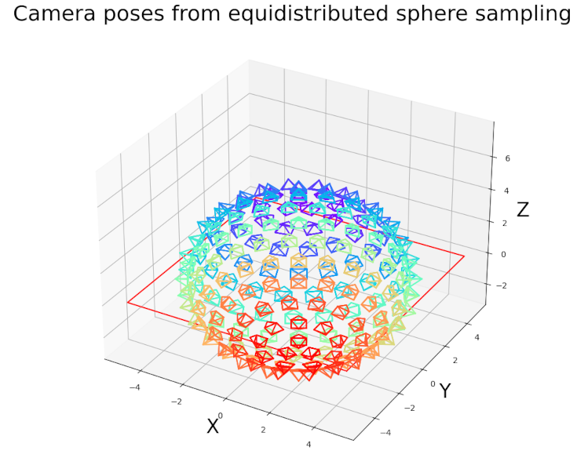

# Useful scripts

This folder contains scripts that may help ViSP user and developer.

## PerfCompare.py

Python script useful to compare benchmark performances before and after a potential source code modification/optimization or to compare performances using different third-party libraries.

For example in `$VISP_WS/visp-build/module/core` let us consider the `perfMatrixMultiplication` binary.

Depending on your python installation you may install support for enumerations:

```console
$ pip install enum
```

This script works like this:

- run first the performance binary activating benchmark and xml output options:

    ```console
    $ cd $VISP_WS/visp-build/module/core
    $ ./perfMatrixMultiplication --benchmark --reporter xml --out /tmp/log_perfMatrixMultiplication_MKL.xml
    $ ./perfMatrixMultiplication --benchmark --reporter xml --out /tmp/log_perfMatrixMultiplication_OpenBLAS.xml
    ```

- Use the script to compare performances:

    ```console
    $ cd $VISP_WS/visp/script
    $ python PerfCompare.py --before /tmp/log_perfMatrixMultiplication_OpenBLAS.xml \
                            --after /tmp/log_perfMatrixMultiplication_MKL.xml       \
                            --before-label OpenBLAS --after-label MKL
    ```

## create_module.py

This script allows to create the structure of a new ViSP module as explained in this [tutorial](https://visp-doc.inria.fr/doxygen/visp-daily/tutorial-contrib-module.html).

## format-coding-style.sh

This script uses `clang-format` to format ViSP source code. It should be used carefully since a lot of file could be affected.

- To install `clang-format`:

    - On Ubuntu like OS:

        ```console
        $ sudo apt-get install clang-format
        ```
    - On OSX:

        ```console
        $ brew install clang-format
        ```

- To run this script:

    ```console
    $ cd $VISP_WS/visp/script
    $ sh format-coding-style.sh
    ```

- To format a single file with extension `*.h` or `*.cpp`, you may rather run:

    ```console
    $ cd $VISP_WS/visp
    $ clang-format -i <path to file.[h,cpp]>
    ```

## LonLatCamPosesVisualizer.py

This Python script allows displaying camera poses sampled from longitude / latitude coordinates and using a method for regularly sampled points on a sphere.

Example (use the help option `-h` to display the available parameters):

```console
python3 LonLatCamPosesVisualizer.py --full-sphere
```

Following image shows camera poses equidistributed sampled on a sphere:



## Blender/look_at.py

This Python script can be used in a Blender scene and contains example code for:

- camera look-at function, to automatically point the camera toward a specific object,
- retrieving the camera pose with respect to another Blender object,
- and save camera images in a `/tmp/` directory.

To test this script:

- on Ubuntu/Linux launch Blender from a Terminal and use the default scene,
- switch to the [Text Editor](https://docs.blender.org/manual/en/dev/editors/text_editor.html) and open the Python script,
- when running the script, you should see the corresponding camera poses outputed on the terminal.
